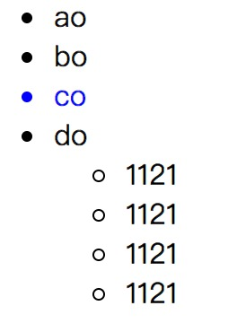
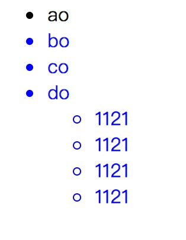
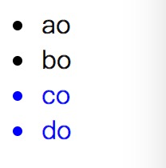

<!-- toc orderedList:0 depthFrom:1 depthTo:6 -->

* [CSS选择器](#css选择器)
    * [元素选择器](#元素选择器)
    * [关系选择器](#关系选择器)

<!-- tocstop -->

# CSS选择器

## 元素选择器

```css
p {line-height:1.5em; margin-bottom:1em;}
```

## 关系选择器

 - E F：后代选择器，该选择器选择元素E的后代中所有元素F：

```css
ul li {margin-bottom:0.5em;}
```

 - E > F：子选择器，该选择器选择元素E的直接子元素中的所有元素F。

```css
ul>li{color: blue;}
```

```html
<ul>
    <li>ao</li>
    <li class="test">bo</li>
    <li>co</li>
    <li>
        do
        <ul>
            <li>1121</li>
            <li>1121</li>
            <li>1121</li>
            <li>1121</li>
        </ul>
    </li>
</ul>
```

以上都`li`标签字体颜色都是蓝色。

 - E + F：相邻兄弟选择器，元素F与元素E具有相同父元素，且位于E元素后面的F元素会被选中，这个选择器只会选择一个，但可以循环下去。


```css
.test +li{
    color: blue;
}
```


```css
li +li {
    color: blue;
}
```


>1121这个数字是蓝色，原因是继承了父元素样式。

 - E ~ F：通用兄弟选择器，该选择器要求有共同父元素的，且E元素后面的所有F元素会被选中。



>参考：http://www.w3cplus.com/css3/basic-selectors
