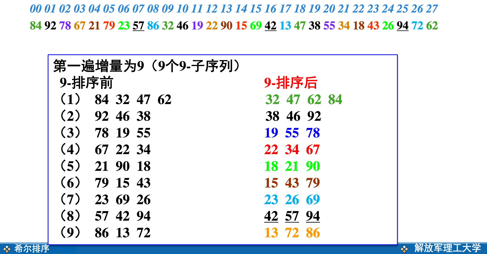
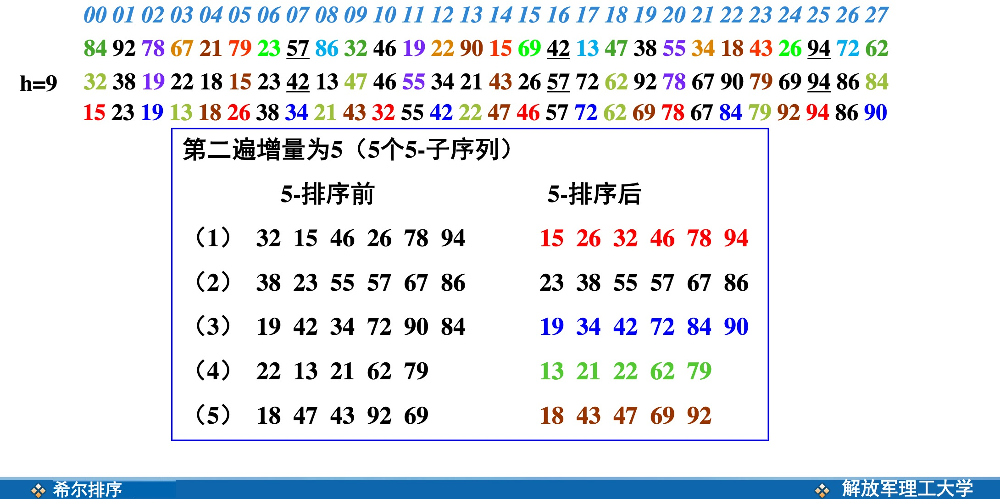
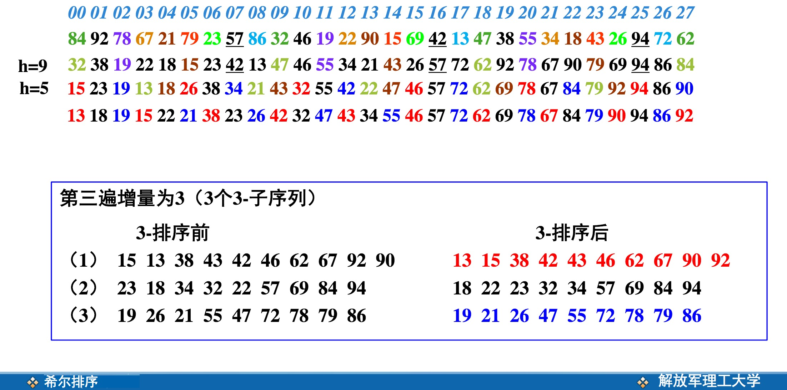
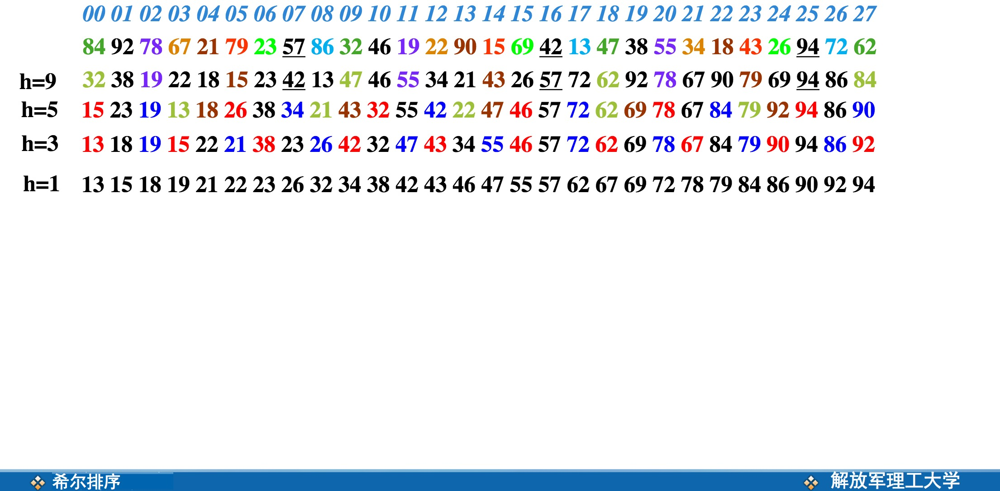

<!-- toc orderedList:0 depthFrom:1 depthTo:6 -->

- [数据算法](#数据算法)
	- [插入排序](#插入排序)
		- [直接插入排序](#直接插入排序)
		- [二分插入排序](#二分插入排序)
		- [希尔排序](#希尔排序)

<!-- tocstop -->

# 数据算法

## 插入排序

插入排序种类：

1. 直接插入排序
2. 二分插入排序
3. 希尔排序

### 直接插入排序

 - 原始数据越接近有序，排序速度越快

 - 最坏情况下（输入数据是逆有序的）TW(n)=O(n2)

 - 平均情况下，耗时差不多是最坏情况的一半TE(n)=(n2)

 - 为提高排序速度，要
     - 减少元素的比较次数
     - 减少元素的移动次数直接插入排序

###  二分插入排序

在有序部分使用二分定位的方法比较

### 希尔排序

 - 缩小增量
 - 多遍插入排序

>例如选用增量序列（9，5，3，1），进行4遍插入排序







>图片来自[解放军理工大学慕课](http://www.icourse163.org/course/UST-1001660013#/info)


这种算法先比较部分的先后次序，再比较整体。
算法的时间复杂度与增量序列有关，计算公式为：

```js
O(n3/2),O(n(logn)2)
```
