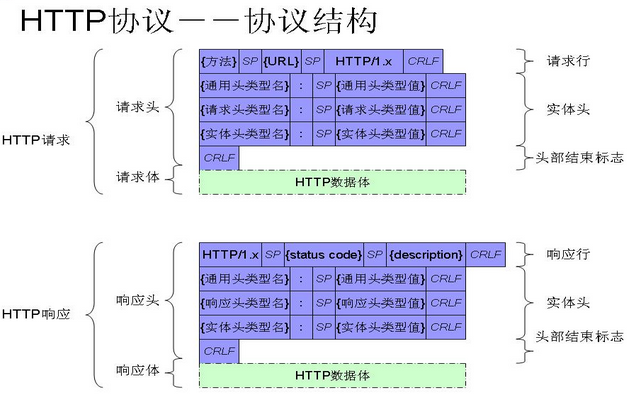

<!-- toc orderedList:0 depthFrom:1 depthTo:6 -->

* [爬虫](#爬虫)
    * [Http知识](#http知识)
    * [get与post请求](#get与post请求)

<!-- tocstop -->

# 爬虫

爬虫的本质就是**模拟浏览器来打开网页**。

## Http知识

每个网页链接，或者称作url，通常包含以下几个部分，`协议://域名:端口/路由?参数`。

 - 协议：数据传输所使用的协议，例如 `http` ；

 - 域名：所访问服务器的域名，例如 `sina.com.cn` ，如果没有域名则为服务器IP；

 - 端口：链接所使用的端口，Http请求的默认端口是`80`，可以省略；

 - 路由：不同的路由会请求到不同的功能，例如 `college/scorelist` 请求的是查看大学的分数线列表这一功能；

 - 参数：请求数据时所提供的参数，参数的 key 和 value 由 = 连接，参数之间以 `&`分隔，例如` tab=batch&wl=1`

下爬虫，要对目标网站进行分析。在Chrome浏览器中，`Network`标签记录网页请求资源及其时间。写爬虫，`XHR`、`JS`、`Doc`等资源是获取数据的关键。

## get与post请求

`GET`请求，参数直接写在url中，因此是显式可见的，即 `所访问的服务 + 参数`。

`POST`请求，在POST请求中，参数并不是直接写在url中，而是在数据包内部提供，所以不是显示可见的。

**HTTP协议--协议结构**

>[HTTP Header详解](https://kb.cnblogs.com/page/92320/)
>[HTTP协议](https://zhuanlan.zhihu.com/p/25301841?refer=pachong)
